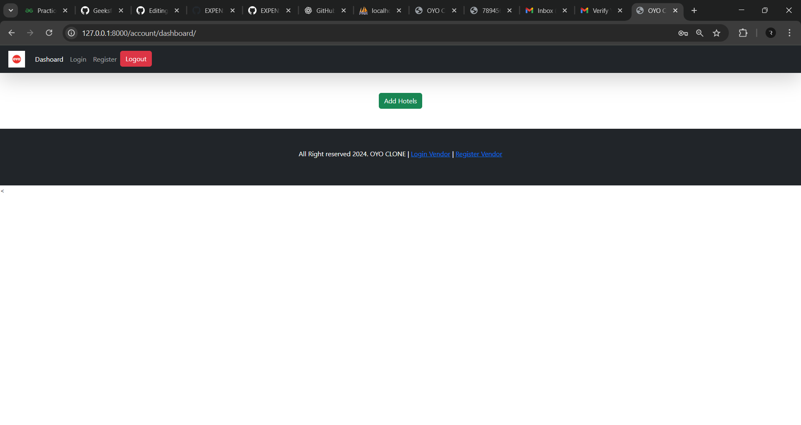
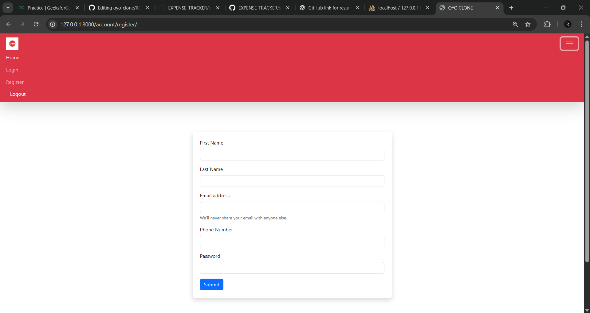

<h1 align="center">🏨 OYO Clone – Hotel Booking Application</h1>
<p align="center">
  
  
  
  
</p>

## Project Overview:
The OYO Clone Django Project aims to replicate the functionalities of the popular hotel booking platform OYO, providing users with a seamless experience for discovering, booking, and managing hotel accommodations. Leveraging the Django framework, this project will focus on delivering a robust and scalable web application tailored to meet the needs of modern travelers.
## Key Features:
🔑 User Authentication:
   - Users will be able to create accounts and log in securely using their email addresses. Authentication will be reinforced with one-time password (OTP) verification, ensuring account security.


🏨 Hotel Listings:
   - The application will showcase a comprehensive list of hotels, including details such as location, amenities, room types, and pricing. Users can filter and search for hotels based on their preferences, such as location, price range, and rating.


📅 Booking Management:
   - Once users find their desired hotel, they can proceed to book rooms seamlessly through the platform. The application will facilitate the selection of room types, booking dates, and any additional services, providing a smooth booking experience.


🚀 Confirmation and Notifications:
   - Upon successful booking, users will receive instant confirmation of their reservations via email or SMS. Additionally, they will receive notifications regarding booking updates, such as payment confirmation, check-in details, and other relevant information.

📊 Admin Dashboard 
   - Manage hotels, users, and bookings through Django Admin.
     
📱 Responsive Design 
- Works across desktop, tablet, and mobile devices.


OYO_CLONE/

│-- accounts/                 # user, vendor, html templates, view logic 

│-- home/             # base,utils, templates

│-- hotels/          # Django app for hotel management

│-- static/             # CSS, JS, Images

|-- oyo_clone  # django main project setup

│-- db.sqlite3 / MySQL  # Database

│-- manage.py           # Django project manager


🛠️ Tech Stack

- Frontend: HTML, CSS, Bootstrap, Flora editor

- Backend Framework: Django (Python)

- Database: MySQL (via XAMPP)

- Server: Django Development Server, XAMPP Server

- Version Control: Git & GitHub


⚙️ Installation & Setup

Clone the repository
```bash

git clone https://github.com/nameisrahul/OYO-CLONE.git
cd OYO-CLONE
```

Create a virtual environment
```bash
python -m venv venv
```

Activate it

Windows:
```bash
venv\Scripts\activate
```

Mac/Linux:
```bash
source venv/bin/activate
```

Install Dependencies
     change it to the project directory
     ``` bash
     cd oyo_clone
     ```
    
  - open the code in VScode or any IDE's 

Apply migrations
```bash
python manage.py makemigrations
python manage.py migrate
```

Run the development server
```bash
python manage.py runserver
```

Open the app in your browser at
👉 http://127.0.0.1:8000/

📸 Screenshots:


![user register form] (screenshots/user register form.png).








